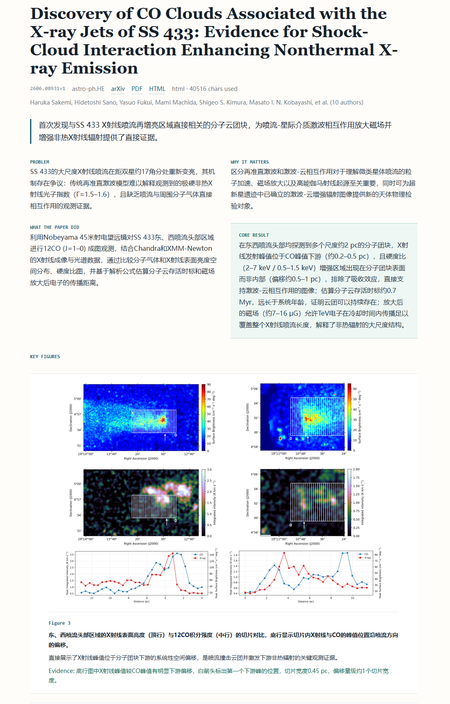

# arxiv-astro

A local arXiv research reader for discovering, selecting, and interpreting recent astronomy papers with LLM assistance.




## What Is This?

`arxiv-astro` is a local reading pipeline for astronomy papers.

Input:

- an arXiv category or category group
- optional research interests
- an OpenAI-compatible LLM endpoint

Pipeline:

```text
fetch metadata -> select papers -> load text and figures -> interpret -> report
```

## Quick Start

1. Install locally:

```bash
pip install -e .
```

Check available CLI options:

```bash
arxiv-astro -h
```

2. Configure DeepSeek in `.env`:

```bash
DEEPSEEK_API_KEY=your-api-key
DEEPSEEK_BASE_URL=https://api.deepseek.com
DEEPSEEK_MODEL=deepseek-v4-pro
```

3. Run a complete reading pipeline:

```bash
arxiv-astro run \
  --category astro-ph \
  --fetch-results 10 \
  --max-results 2 \
  --interests "papers related to the FAST radio telescope and radio interferometric methods"
```

4. Generate an HTML report from the final manifest:

```bash
arxiv-astro report --input data/runs/2026-date_astro-ph.IM/manifest.json
```

5. Serve reports and downloaded figures locally:

```bash
arxiv-astro serve --port 8765
```

Open:

```text
http://localhost:8765/
```

## Configuration

For normal use, you only need to set the API key. Optionally change the model name if your DeepSeek account uses a different model.

```bash
DEEPSEEK_API_KEY=your-api-key
DEEPSEEK_MODEL=deepseek-v4-pro
```

You can put them in a `.env` file or export them in your shell.

Advanced options:

| Variable | Default | Purpose |
| --- | --- | --- |
| `DEEPSEEK_API_KEY` | empty | API key used by the OpenAI-compatible LLM client. Required for selection and interpretation. |
| `DEEPSEEK_BASE_URL` | `https://api.deepseek.com` | OpenAI-compatible API endpoint. Usually does not need to change. |
| `DEEPSEEK_MODEL` | `deepseek-v4-pro` | Model used for paper selection and interpretation. |
| `OUTPUT_DIR` | `data` | Root directory for paper cache, run manifests, figures, and reports. |
| `REQUEST_TIMEOUT` | `30` | Timeout in seconds for arXiv/content/figure HTTP requests. |
| `LLM_REQUEST_TIMEOUT` | `180` | Timeout in seconds for LLM requests. |
| `MAX_INPUT_CHARS` | `400000` | Maximum paper text characters sent to the interpretation task. |
| `LLM_MAX_OUTPUT_TOKENS` | `12000` | Maximum output tokens requested from the LLM. |
| `PAPER_INTERESTS` | empty | Default research interests used by `run` when `--interests` is omitted. |
| `FETCH_RESULTS` | `100` | Default number of metadata candidates fetched before selection. |
| `SELECTION_MAX_INPUT_CHARS` | `220000` | Maximum metadata prompt size for paper selection. |
| `SELECTION_SUMMARY_MAX_CHARS` | `4000` | Maximum abstract characters per paper used during selection. |
| `DEBUG` | false | Enables debug logging when set to `1`, `true`, `yes`, or `on`. |

Debug logging example:

```bash
DEBUG=1 arxiv-astro fetch --category astro-ph.IM --max-results 5
```

## Category Syntax

Single category:

```bash
--category astro-ph.IM
```

Astrophysics archive group:

```bash
--category astro-ph
```

`astro-ph` expands to:

```text
astro-ph.CO
astro-ph.EP
astro-ph.GA
astro-ph.HE
astro-ph.IM
astro-ph.SR
```

Multiple categories:

```bash
--category astro-ph.IM,astro-ph.HE
```

The category expression is sent as one arXiv API OR query where possible.

## License

This project is licensed under the GNU General Public License v2.0. See [LICENSE](LICENSE).
